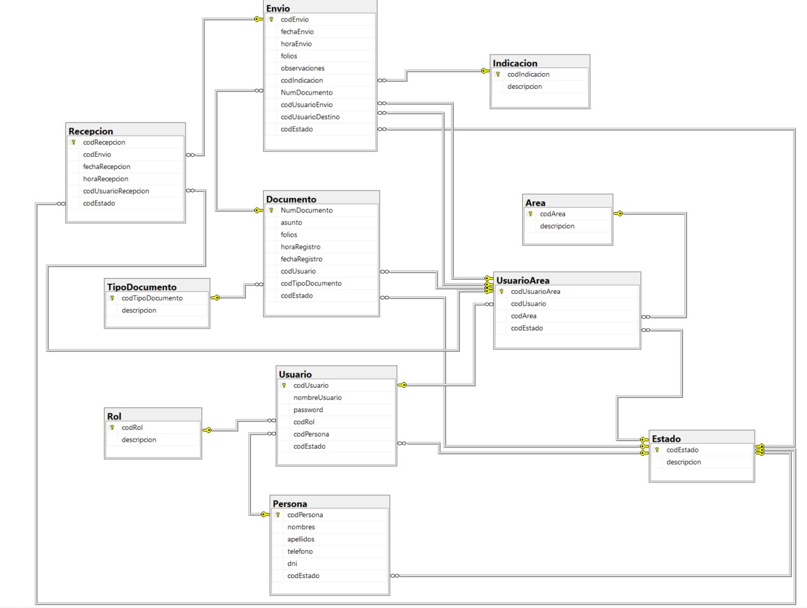

# Sistema de Seguimiento de Documentos Internos y Externos

Este es un sistema para dar seguimiento a los documentos internos y externos, aplicando el patrón de arquitectura de modelo-vista-controlador (MVC). Está realizado en el lenguaje `php v8.3` usando el gestor de base de datos `Microsfot SQL Server`.

Diagrama de Entidad Relación (ER):



## ¿Cómo descargar el proyecto?

Primero descargamos este proyecto como `.zip` o clonarlo haciendo uso de un comando de `git`, de la siguiente manera:

```
git clone https://github.com/MrDevv/Seguimiento-de-Documentos-MDE.git
```

Abrimos el proyecto en `Visual Studio Code` o algún otro IDE.

## Creación de  la base de Datos

Dentro del proyecto encontraremos un archivo sql `script_db.sql` que contiene los comandos para crear la base de datos con sus tablas.

Una vez creada la base de datos, creamos los procedimientos almacenados que están dentro de la carpeta `stored procedures`.

## Registro de datos importantes

Ejecutamos los comando del archivo `scrips.sql` que contine los datos iniciales para poder acceder al sitema.

## Configuración de la base de datos

Ahora tenemos que configurar el archivo `DataBase.php` que se encuentra dentro del proyecto en la carpeta de **config** del proyecto.

Encontraremos el siguiente contenido:

```
    private static $serverName = "localhost";
    private static $database = "Sistema_Seguimiento_Documentos";
    private static $username = "sa";
    private static $password = "admin";
```

El serverName de la base de datos esta en entorno local, si ha cambiado la configuración al momento de instalar el gestor, considerar su configuración.

Para el **username** y el **password** debe colocar sus credenciales que configuró en su gestor de base de datos.

## Configuración de constantes en el sistema

Ahora tenemos que configurar el archivo `parameters.php` que se encuentra dentro del proyecto en la carpeta de **config** del proyecto.

Encontraremos la siguiente constante:

```
    define("base_url", "http://localhost/Seguimiento-de-Documentos-MDE/");
```

Cambiamos el valor de la constante de acuerdo al entorno en la que se despliega el sistema.

Por último configuramos el archivo `.htaccess` que se encuentra en la raíz del proyecto.

```
    ErrorDocument 404 http://localhost/Seguimiento-de-Documentos-MDE/error/index
```
Cambiamos la URL por la nuestra.